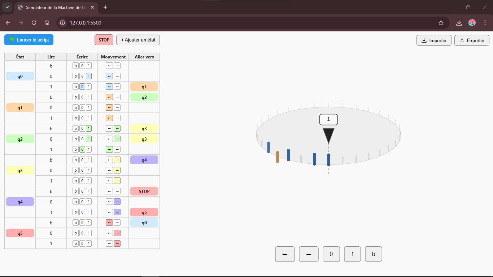

# Turing Machine Simulator

[French version here!](docs/README_fr.md)



**Live Demo:** [https://maxdkn.github.io/turing-machine](https://maxdkn.github.io/turing-machine)

An interactive and educational Turing Machine simulator designed for [machinedeturing.com](https://machinedeturing.com).

You can create states, define transitions, run the machine, edit during the runtime, and export your configuration as JSON or as a visual graph.

---

## Features

* Add and edit states during runtime.
* Define rules: read, write, move, next state.
* Interactive tape display (circular visualization).
* Step-by-step execution with highlighted active rules.
* Pause and resume execution.
* Export and import as JSON.
* Drag and drop interface for transitions.
* Educational and interactive for learning Turing Machine concepts.

---

## How to Use

1. Clone or download this repository:

   ```bash
   git clone https://github.com/MaxDkn/turing-machine.git
   ```

2. Open `index.html` in your browser (or use GitHub Pages).

3. Add states and rules, then run the simulation with the green button.

4. Pause/resume or stop as needed.

5. Export configuration for sharing or backup.

---

## 📦 Export

You can export your program in two formats:

* **JSON**: Complete configuration of states and tape.
* **Image (SVG)**: Visual representation of the program graph (not ready yet).

👉 You can also find ready-to-use **example JSON programs** in [`docs/exemple/`](docs/exemple/).

---

## 📝 TODO

Planned improvements and next steps for the project:

* [ ] **Export as complete schema/graph**
  Generate a full visual diagram of the Turing machine (beyond JSON or tape).

* [ ] **Editable tape**
  Add an interface to directly modify the tape content before or during execution.
  *(Currently not planned but could be reconsidered.)*

* [ ] **User Interface (UI) revision**
  Improve colors, layout, buttons (e.g., primary/secondary styles), and overall design consistency.

* [ ] **Responsive design**
  Adapt the application to work seamlessly on different screen sizes (desktop, tablet, mobile).

* [ ] **Import example programs directly**
  Allow loading example JSON files into the app with one click (from `docs/exemple/`).

* [ ] **Possibility to write code**
  Add an other interface as the pseudo-code to faster write instruction.
 
---

## License

This project is licensed under the **GNU General Public License v3 (GPLv3)**.
See [LICENSE](LICENSE) for details.